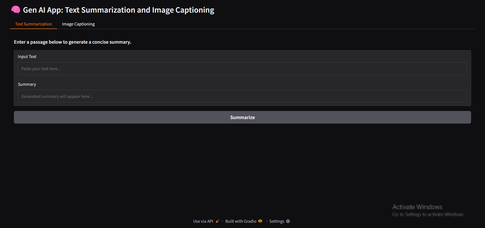
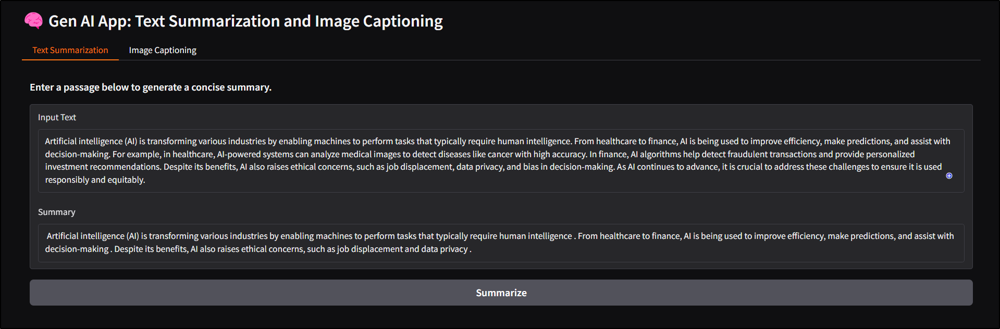
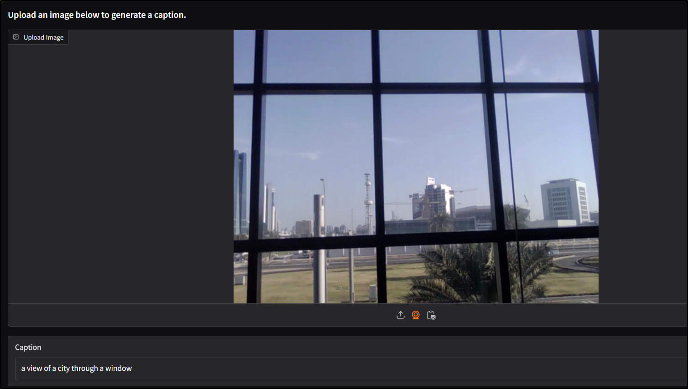

# Text Summarization and Image Captioning Generative AI Application
## Models used to accomplish Text Summarization and Image Captioning
### `sshleifer/distilbart-cnn-12-6` - NLP Model
### `Salesforce/blip-image-captioning-base` - a 14M parameter captioning model

`Interface of the App built with Gradio`

`Sample Text Summarization Task`

`Image Captioning from a Webcam`

